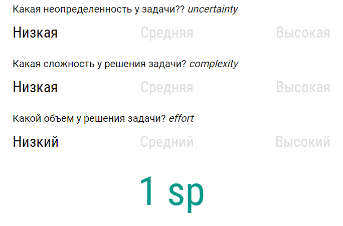

# Сколько сториков?

Сайт позволяет посчитать кол-во стори пойнтов для оценки задачи.

Оценка строится из трех шагов:

1. Оценить кол-во информации которое известно о задаче и её решении - _uncertainty_
2. Оценить объем решения задачи. Сколько обязательных шагов подразумевает решение задачи? - _complexity_
3. Оценить сложность решения задачи. Насколько легко или трудно реализовать задачу, когда о ней всё известно? - _effort_

Ниже представлен матрица, которая позволяет рассчитать стори поинты исходя из значения каждого критерия задачи

| Неопределенность  | Объем задачи  | Сложность | Оценка задачи |
|:-------------     |:------:|:---------:|:--:|
| low               | low    | low       |  1 |
| low               | low    | medium    |  2 |
| low               | low    | high      |  5 |
| low               | medium | low       |  2 |
| low               | medium | medium    |  3 |
| low               | medium | high      |  5 |
| low               | high   | low       |  3 |
| low               | high   | medium    |  5 |
| low               | high   | high      |  8 |
| -                 | -      | -         |  - |
| medium            | low    | low       |  3 |
| medium            | low    | medium    |  5 |
| medium            | low    | high      |  8 |
| medium            | medium | low       |  5 |
| medium            | medium | medium    |  5 |
| medium            | medium | high      |  8 |
| medium            | high   | low       |  5 |
| medium            | high   | medium    |  8 |
| medium            | high   | high      | 13 |
| -                 | -      | -         |  - |
| high              | low    | low       | 8  |
| high              | low    | medium    | 8  |
| high              | low    | high      | 13 |
| high              | medium | low       | 8  |
| high              | medium | medium    | 8  |
| high              | medium | high      | 13 |
| high              | high   | low       | 13 |
| high              | high   | medium    | 13 |
| high              | high   | high      | 20 |
